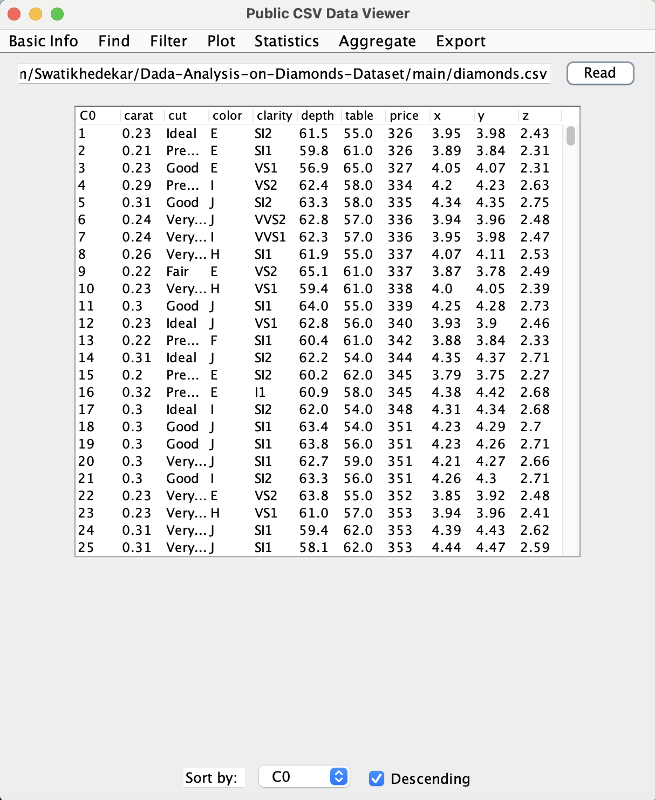

# PublicDataViewer

## Overview
A project for Java Advanced Programming, a part of Data Science Bachelor Engineering Programme at Warsaw University of Technology.
This tool is designed to enable users loading, exploring and analyzing CSV files from internet.

## Features
- **CSV File Loading**: Users can load CSV files directly from the internet by providing a link.
- **Data Exploration**: Provides basic information about the dataset, including data types of columns and the size of the data frame.
- **Aggregation**: Enables users to perform various aggregation operations such as finding maximum and minimum values in columns, as well as calculating statistics like mean and standard deviation.
- **Sorting**: Users can sort the data frame by specific columns.
- **Value Lookup**: Allows users to search for specific values within the data frame.
- **Save Changes**: Users can save their modifications or analysis results as a new CSV file. 

## Libraries
This project uses openCSV library for parsing CSV files.

## Developers
Developed by: [@Gaspar Sekula](https://github.com/GasparSekula) and [@Michał Piechota](https://github.com/piechotam)

